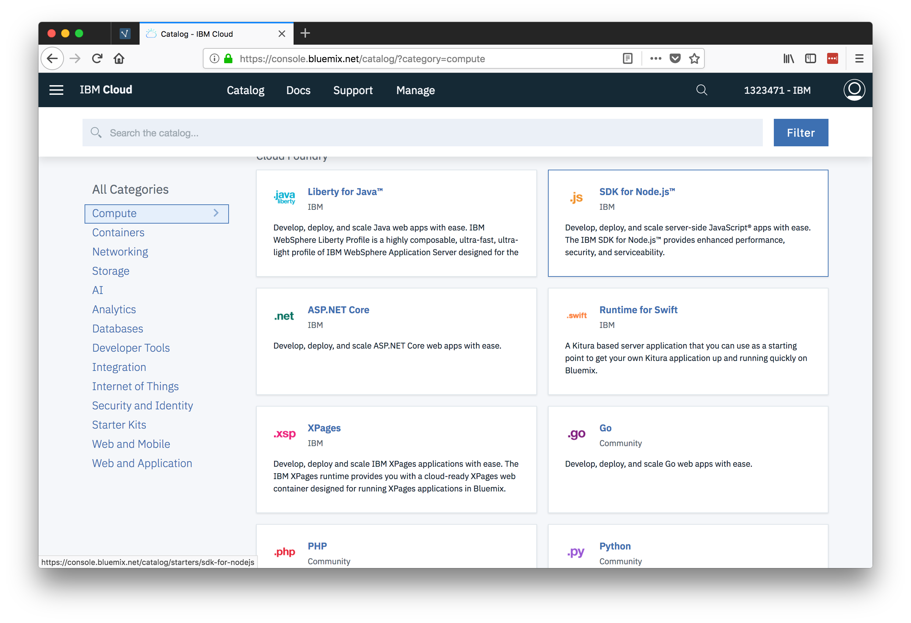
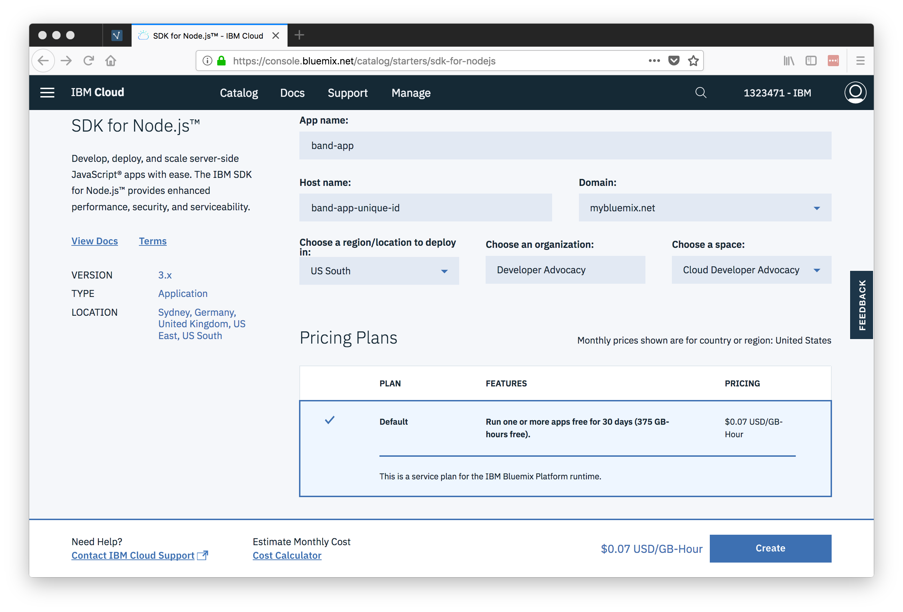

# Deploy

🖥 To see the code for this step, here is [commit/diff](https://github.com/StrongLoop-Evangelists/band-app/commit/b065a8854831c44371aa2c49bc9f365ffd6f2b68
).

---

A LoopBack app is simply a Node.js app. For our purposes, we will deploy our code to [IBM Cloud](https://bluemix.net), IBM's PaaS (platform as a service), but we could deploy it wherever Node.js is supported. If we were to deploy our app to a conventional server, we would need to make sure the tools were in place to keep our app running and able to handle any sort of load it may need to withstand. Fortunately, IBM Cloud handles all of that for us and we can use their Cloud Foundry tools to configure and manage the deployment.

## Create Node.js Cloud Foundry app:

In this step, we need to go into the [IBM Cloud catalog](https://console.ng.bluemix.net/catalog/) and from the `Compute` section we will choose to create a Node.js Runtime App:



### Create the Node.js app

Choosing the SDK for Node.js takes us to a page where we can name our application as well as choose the IBM Cloud route to access our app:

> Note: The route must be unique, but the name should be `band-app`



*Note: take notice of the org and space you created this app in on IBM Cloud. It is likely you only have one of each, but it is not uncommon to have more than one of one or the other. Which org/space you are currently in is where the app will be created.*

The next page presented to us after creating our Node.js app shows the app starting up. On this page, we will also see some instructions for using a sample app and getting started. We are going to skip that in favor of the following steps:

## Prepare our app and local environment

We can now switch back to the terminal and our editor to get our local environment prepped and our application set up.

### Create our `manifest.yml` file

Let's go into the root of our LoopBack application and create a `manifest.yml` file and add the following information, changing "name" to the name we chose when creating the Cloud Foundry app.

It should look something like so:

```yaml
name: band-app
memory: 256M
```

## Install IBM Cloud CLI to push to Cloud Foundry

Install the IBM Cloud [command line interface](https://console.bluemix.net/docs/cli/reference/ibmcloud/download_cli.html#install_use).

Log in to the IBM Cloud CLI with your IBM ID.

```shell
ibmcloud login
```

If you have a federated account, include the `[--sso]` flag. If you have an api key, use the `--apikey` flag.

```shell
ibmcloud login [--sso]
```

## Login to CF API Endpoint on IBM Cloud

```
ibmcloud target --cf-api api.ng.bluemix.net
ibmcloud target --cf
```

## Deploy!

### Push our code `ibmcloud cf push`

We can push our code to Bluemix by running the `ibmcloud cf push` command. Doing so will use our `manifest.yml` file and the settings we have just chosen to deploy our app in the cloud.

```bash
➜  band-app git:(master) ✗ ibmcloud cf push

```

At this point, our app is in the cloud and we can visit the app at the urls stated in the output above: `urls: bapp.mybluemix.net` (*your url will be different*)

### Show our app status `ibmcloud cf apps`

And at any point, we can check our apps by running `ibmcloud cf apps`. The output should looks something like:

```bash
➜  band-app git:(master) ✗ ibmcloud cf apps
Getting apps in org StrongLoop Evangelists Org / space Band App as joesepi@ibm.com...
OK

name       requested state   instances   memory   disk   urls
band-app   started           1/1         256M     1G     bapp.mybluemix.net
```

Check out the LoopBack app personal URL and the explorer by appending `/explorer`.

**Next Step:** [Connect a datasource](07-datasource.md)
